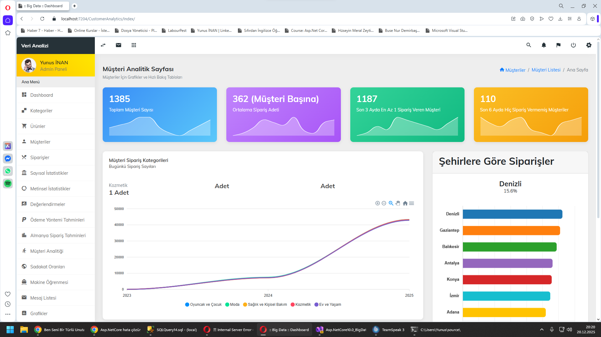
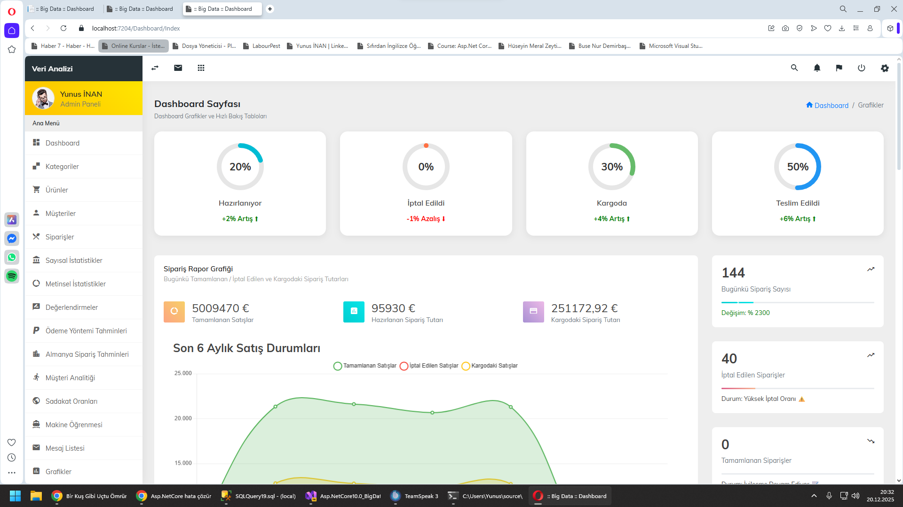
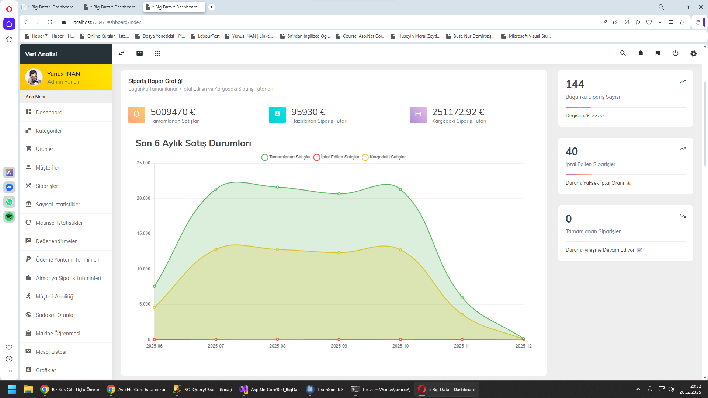
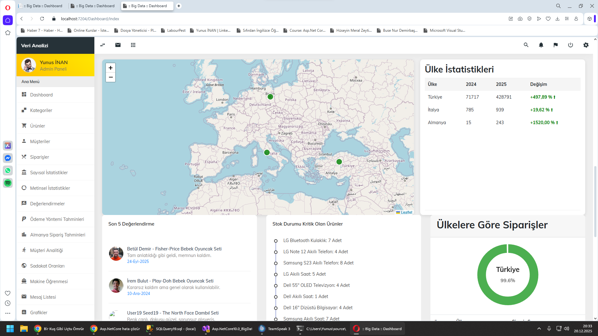
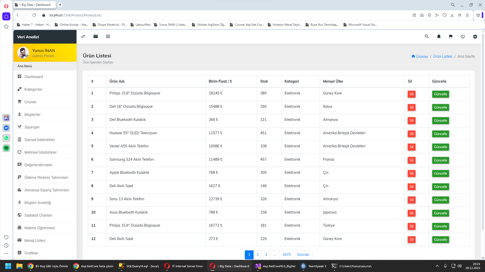
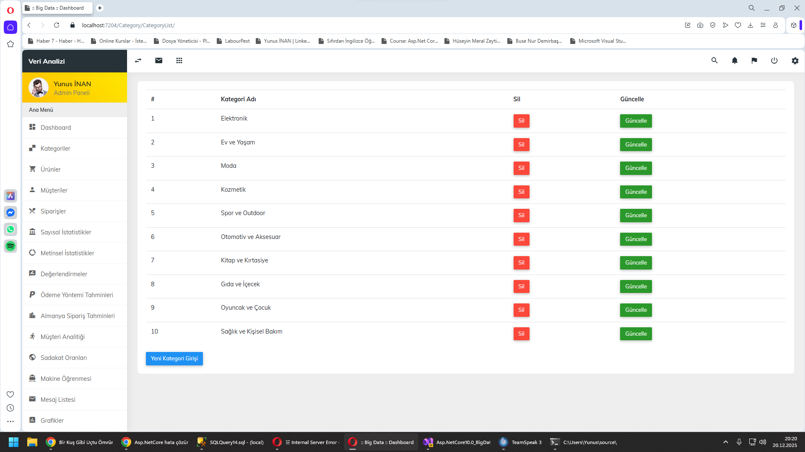
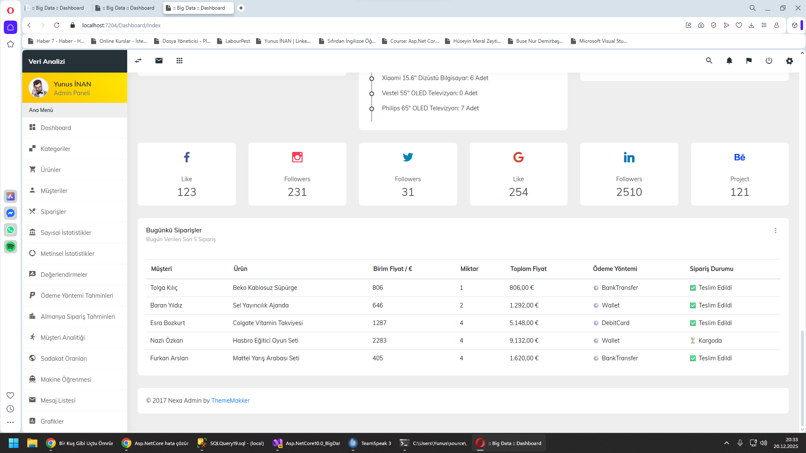
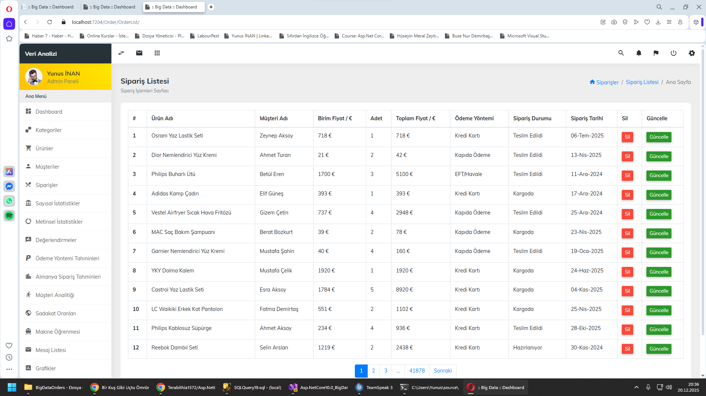
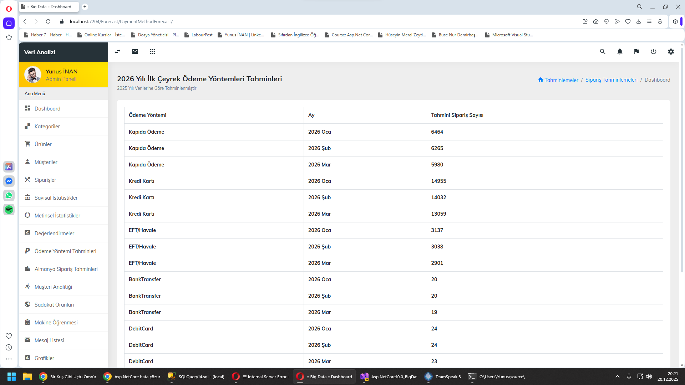
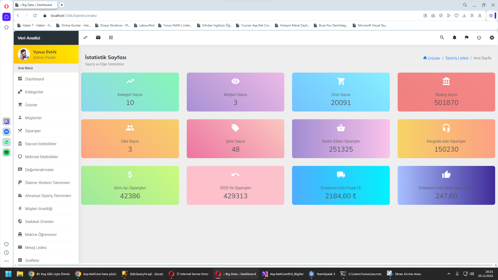

# 📊 Asp.NetCore10.0 Big Data Analytics Project

Bu proje, **ASP.NET Core 10.0** kullanılarak geliştirilmiş, büyük ölçekli veri setleri üzerinde  
**istatistiksel analizler, dashboard görselleştirmeleri ve tahminleme (forecasting)** işlemleri  
yapmayı amaçlayan kapsamlı bir **Big Data & Analytics** uygulamasıdır.

Proje; siparişler, ürünler, müşteriler, kategoriler ve ödeme yöntemleri gibi yüksek hacimli  
verileri analiz ederek **yönetimsel karar destek panelleri** sunar.

---

## 🚀 Proje Özellikleri

- 📈 **Gelişmiş Dashboard**
  - Günlük siparişler
  - Tamamlanan / Kargoda / İptal edilen siparişler
  - Son 6 aylık satış durumları (grafiklerle)

- 🌍 **Ülke & Şehir Bazlı Analizler**
  - Ülkelere göre sipariş dağılımı
  - Şehirlere göre sipariş yoğunluğu
  - Harita (Leaflet) entegrasyonu

- 📦 **Ürün & Stok Analizi**
  - Kritik stoktaki ürünler
  - En çok / en az satılan ürünler
  - Ortalama ürün fiyatları

- 👤 **Müşteri Analitiği**
  - En aktif müşteri
  - Son 3 ayda en az sipariş veren müşteriler
  - Uzun süredir sipariş vermeyen müşteriler

- 💳 **Ödeme Yöntemi Tahminleri**
  - 2026 ilk çeyrek ödeme yöntemi tahminleri
  - Kredi Kartı, EFT/Havale, Kapıda Ödeme vb.

- 🧠 **Makine Öğrenmesi & Tahminleme**
  - Gelecek dönem sipariş tahminleri
  - Veri bazlı öngörüler (ML.NET)

---

## 🧩 Kullanılan Teknolojiler

- **ASP.NET Core 10.0**
- **Entity Framework Core**
- **MS SQL Server**
- **LINQ**
- **ViewComponent**
- **Chart.js / ApexCharts**
- **Leaflet Map**
- **Bootstrap / Admin Dashboard UI**
- **ML.NET (Forecasting & Analytics)**

---

## 🗄️ Veritabanı Yapısı (Özet)

- Orders
- Products
- Categories
- Customers
- PaymentMethods
- Reviews

> Proje, **Big Data simülasyonu** olacak şekilde yüksek hacimli veri setleri ile çalışacak biçimde tasarlanmıştır.

---

## 📸 Proje Görselleri

### 🔹 Müşteri Analitiği


### 🔹 Genel Dashboard


### 🔹 Sipariş & Satış Grafikleri


### 🔹 Ülke Bazlı Sipariş Dağılımı


### 🔹 Metinsel & Sayısal İstatistikler


### 🔹 Ürün Listesi


### 🔹 Kategori Yönetimi


### 🔹 Günlük Siparişler


### 🔹 Sipariş Listesi


### 🔹 Ödeme Yöntemi Analizi & Tahminleri


### 🔹 Genel İstatistikler


---

## ⚙️ Kurulum

```bash
git clone https://github.com/Terabithia1572/Asp.NetCore10.0_BigData_Analytics_Project.git

👨‍💻 Geliştirici

Yunus İNAN

GitHub: https://github.com/Terabithia1572

ASP.NET Core | Big Data | Microservices | Analytics

